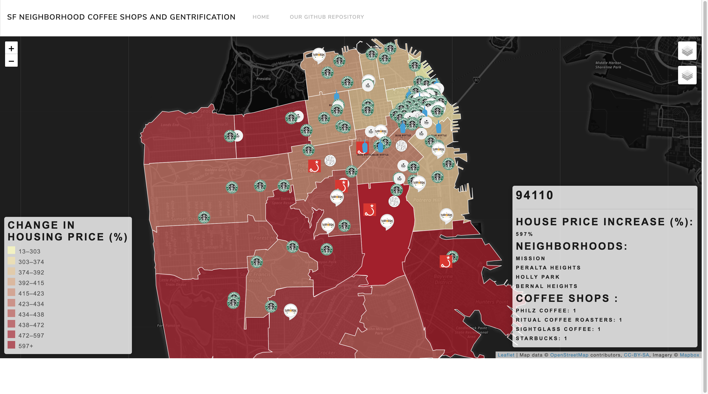

# Project-3 Using demographics and coffee shops to predict future housing prices
*By Kylie Tan, Quynh Nhu Bui, Michael Boese, and Bani Vafa*

APP URL: https://sleepy-badlands-55454.herokuapp.com/

The purpose of this project was to create an engaging full-stack, app-driven,  visualization of the results of an inquest into a topic we feel passionate about.

As members of one of the groups of people who are often to blame for the gentrification of countless neighborhoods across the United States, we felt compelled to learn more about how gentrification impacts the neighborhoods it acts upon.

A sentiment that most of us have heard echoed in conversations about gentrification is that it leaves hipsters and hipster coffee shops in its wake after it has pushed out long-time mom-and-pop businesses. Our goal for this project was to create a visualization that will serve as the starting point in our quest to better understand, and visualize this sentiment. To do that, we overlay the locations of coffee shops belonging to six of the largest purveyors of second and third wave coffee in San Francisco over two toggleable choropleth polygons layers which representing individual San Francisco neighborhoods whose color values correspond to the median housing price of the neighborhood, or the zip codes that comprise all of San Francisco above Daly City, whose polygons are weighted by the percent rate of change in home costs between the years 2014 and 2019 for the zip code containing the Financial District (due to a shorter dataset), and 1996 to 2019 for all the other included zip codes.

Because we want to be able to expand on this app in the future in order to visualize larger, more complex datasets and be able to create some truly informative visualizations, we felt that our best option would be to host our app on Heroku so that we could take advantage of the free 10,000 rows of PostgreSQL database hosing they offer. Doing so has already allowed us to easily expand from a one layer visualization to an selectable 8-layer, responsive, information rich app that we hope to make even better with time.

Building our app to this point has occurred in three stages, the data collection stage, the database construction stage, and the front-end visualization stage.

The data we needed to create our visualization was polygon data for the geographic areas we wanted to display, housing data with which to weight those geographic area's choropleth colors with, and the locations of the stores belonging to the coffee purveyors we selected for this particular visualization. We collected this data by using the Google Places and Attom Data Solutions API's, Zillow's data archive, and a little web-scraping.

We cleaned our data using several Jupyter notebooks and uploaded our desired tables to our Heroku PostgreSQL database using SQLAlchemy, and in order to feed our Leaflet map the data we want to visualize, we use flask_sqlalchemy to query our database for the joined table data required by each component of our Leaflet framework. After receiving the data from the database, our flask app reassembles the data into a geoJSON's that are returned through the app's routes so that they can be easily read in by Leaflet. From there, the Leaflet script we've written handles the rest.

Below is a simple flowchart graphically explaining the way our app functions from front to back, and back to front.

