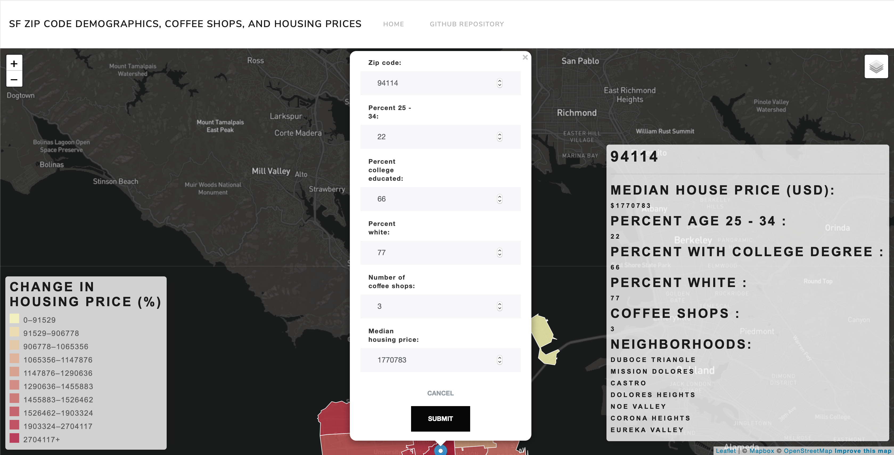

# Using demographics and coffee shops to predict future housing prices

APP URL: https://sf-housing-price-prediction.herokuapp.com

The force of gentrification brings a multitude of changes to the neighborhoods upon which it works. Amongst these are the displacement of a neighborhood's blue collar working class, the displacement of a neighborhood's long-standing communities which oftentimes are comprised primarily by people of color, the emergence of boutiques, trendy coffee shops and beer bars, and the rapid increases in housing prices. This project uses machine learning to predict the change to the next year's housing price within a zip code based on the adjustment of three key demographic features and the number of coffee shops within the selected zip code.

## Motivation

In a previous project, we overlaid the retail locations of six of the Bay Area's largest second and third wave coffee retailers over choropleth polygons representing the neighborhoods of San Francisco, color-weighted by median home sale price in order to visually investigated the potential connection between trendy coffee houses and gentrifying neighborhoods. And while this effort yielded insights into the range of home sale price increases seen by San Francisco neighborhoods and trends in the placement of coffee shops throughout the city, it still did not completely achieve our goal of rigorously demonstrating the effect that changes in key identifiers of gentrification have on local home sale prices.

In order to enhance our work, we conducted a literature review and came across a working paper titled "Nowcasting Gentrification: Using Yelp Data to Quantify Neighborhood Change", by Edward L. Glaeser, Hyunjin Kim, and Michael Luca of the Harvard School of Business (https://www.hbs.edu/faculty/Publication%20Files/18-077_a0e9e3c7-eceb-4685-8d72-21e0f518b3f3.pdf). In this paper, the authors investigated how data from an array of digital platforms "have the potential to improve our understanding of gentrification and enable new measures of how neighborhoods change in close to real time" (Glaeser, Kim & Luca, 2018), and find that the emergence of a new coffee shop in a neighborhood can predict future increases in the gentrification of that neighborhood.

In the course of their paper, the authors identify three demographic indicators that are key to assessing the level to which a neighborhood has gentrified, the percent of a neighborhood's population aged 25 to 34, the percent of a neighborhood's population that hold college degrees, and the percent of a neighborhood's population that is white. By coupling the number of coffee shops in a given neighborhood with the demographic features identified by Glaeser, Kim & Luca, we felt strongly that we could achieve our goal of rigorously demonstrating the effect that changes in key identifiers of gentrification have on local home sale prices.

## App Design

Our vision for this project was to create an app that would be able to take user-inputted values for the three demographic features, the number of coffee shops in a given neighborhood and the current year's median home sale price and through the use of an embedded machine learning model, predict the next year's median home sale price.

The flowchart below explains how the front and backends of our app functions.

For more information about our project, please visit https://kyliejtan.github.io/sf_housing_price_prediction/
